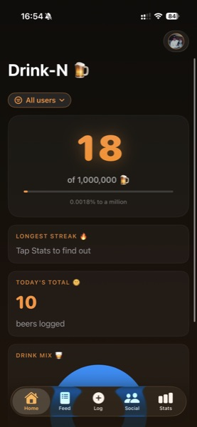
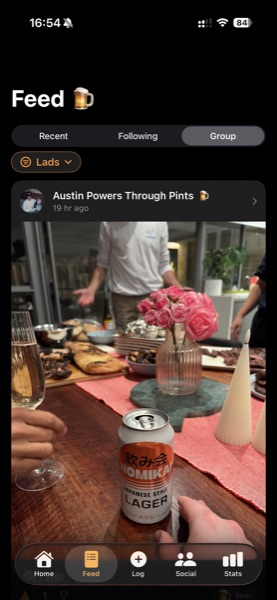
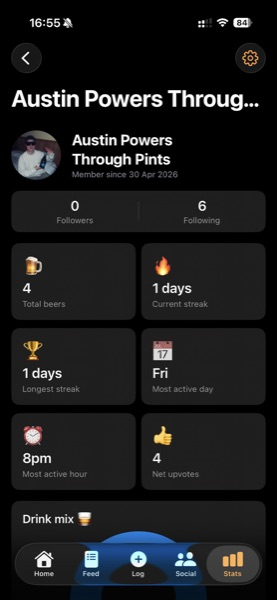
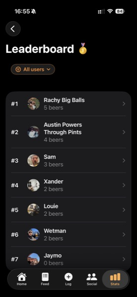
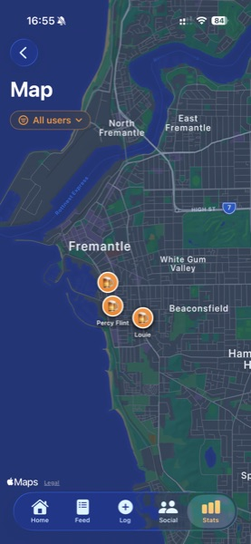
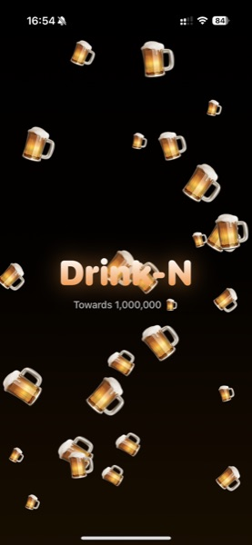

# Drink-N

A social drink-tracking iOS app — log every drink with a photo and location, see what your friends are having in real time, and compete on a running leaderboard.

Live on the [App Store](https://apps.apple.com/) *(pending review)*.

> **This repo is a portfolio snapshot of a shipped product.** The live backend lives in a private repository; the source here is sanitised for public viewing.

---

## Screenshots

| Home | Feed | Profile |
|:-:|:-:|:-:|
|  |  |  |
| **Leaderboard** | **Map** | **Splash** |
|  |  |  |

---

## Tech stack

| Layer | Stack |
|---|---|
| iOS | SwiftUI · Swift 5.9 · iOS 17+ · Combine · Charts · MapKit · Sign in with Apple |
| Backend | Node 20 · Express · ESM · `@supabase/supabase-js` |
| Database | Supabase (Postgres) — RLS enabled, 2 migrations |
| Storage | Supabase Storage (private bucket, signed URLs) |
| Hosting | Railway (auto-deploy on push) |
| Auth | Sign in with Apple → backend-issued session JWT, stored in iOS Keychain |

---

## What it does

- **Log a drink** — beer, wine, spirits, cocktail, or cider — with an optional photo and location
- **Feed** — paginated, with three modes: Recent (everyone), Following (people you follow), or Group (a specific group of friends)
- **Upvote / downvote** drinks in the feed
- **Follow** users; see followers/following counts on every profile
- **Groups** — create one, invite people via fuzzy search, accept/decline invites, promote admins
- **Stats** — personal streaks, drink-type pie chart, cumulative timeline, map of every logged location, photo gallery
- **Leaderboards** — global or scoped to any group you're in
- **Safety scaffolding** required for an alcohol app:
  - Age gate (21+) on first launch
  - Tiered drink-count warnings: soft reminder at 5/day, strong warning + SAMHSA helpline at 8/day, hard block at 15/day
  - Counters tracked locally per device, reset at the local-time day boundary

---

## Architecture

```
┌─────────────────┐       HTTPS       ┌──────────────────────┐       ┌────────────────────┐
│  iOS (SwiftUI)  │  ───────────────► │  Express API         │  ───► │  Supabase Postgres │
│  Sign in w/Apple│  Bearer JWT       │  (Railway)           │       │  + Storage bucket  │
└─────────────────┘                   └──────────────────────┘       └────────────────────┘
        │                                       │
        │  Apple identity token                 │  Service-role key
        │  ────────────────────────────────────►│
```

- **Stateless auth** — backend verifies Apple's identity token, issues its own short-lived session JWT signed with `SESSION_JWT_SECRET`, returned to the client and stored in the iOS Keychain. No third-party auth SDK on the client.
- **Service-role access** — the API uses Supabase's service-role key for all DB writes, applying its own per-user authorisation in middleware. RLS is enabled in the database as a defence-in-depth layer.
- **Image pipeline** — client-side resize before upload (≤1200 px for drink photos, ≤512 px for profile pics, JPEG quality 0.75). Typical upload is 150–250 KB instead of the 4 MB+ a raw iPhone capture would produce.
- **Deploy** — `git push main` triggers a Railway build. iOS app points at the production URL; no localhost fallback in shipped builds.

---

## API surface

| Route | Verb | Description |
|---|---|---|
| `/health` | GET | Liveness probe |
| `/auth/apple` | POST | Exchange Apple identity token → session JWT |
| `/users/me` | GET / PUT | Current user profile (PUT accepts multipart for avatar) |
| `/users` | GET | Leaderboard; `?search=` and `?groupId=` filters |
| `/users/search` | GET | Social-tab user search with `is_following` flag |
| `/users/:id/stats` | GET | Streaks, totals, drink-type breakdown, vote score, follow counts |
| `/beers` | POST / GET | Log a drink / paginated feed (`?mode=recent\|following\|group`) |
| `/beers/total` | GET | Global or group counter |
| `/beers/map` | GET | Coordinates for map pins |
| `/beers/stats` | GET | Charts payload — cumulative, weekly total, drink-type buckets |
| `/groups` | GET / POST | List my groups / create a group |
| `/groups/discover` | GET | Groups I'm not in |
| `/groups/:id` | GET | Detail + member list (membership required) |
| `/groups/:id/leave` | POST | Leave a group |
| `/groups/:id/invite-search` | GET | Fuzzy user search for inviting; excludes existing members + pending invites |
| `/groups/:id/invites` | POST | Invite by user ID or nickname |
| `/groups/:id/members/:memberId/promote` | POST | Admin only |
| `/groups/invites/incoming` | GET | Invites awaiting my response |
| `/groups/invites/:inviteId/accept` | POST | Redeem invite |
| `/groups/invites/:inviteId/decline` | POST | Decline invite |
| `/votes/:beerId` | POST | `{ vote: 1 \| -1 \| 0 }` — 0 clears |
| `/follows/:userId` | POST / DELETE | Follow / unfollow |
| `/follows/me` | GET | Users I follow |
| `/follows/:userId/followers` | GET | Followers of a user, with `is_following` flag for the caller |
| `/follows/:userId/following` | GET | Who a user follows, with `is_following` flag for the caller |

---

## Repository layout

```
.
├── ios/
│   └── BeerTracker/        # SwiftUI source (Models, Networking, Views)
├── backend/
│   ├── src/
│   │   ├── index.js        # Express app, middleware, route mounting
│   │   ├── routes/         # auth · users · beers · groups · votes · follows
│   │   ├── middleware/     # JWT auth guard
│   │   └── utils/          # Apple token verification, geo, session, group filter
│   ├── package.json
│   └── .env.example
├── supabase/
│   └── migrations/         # 001 initial schema · 002 groups/votes/drink-type/follows
└── docs/
    └── screenshots/
```

---

## Running the backend locally

```bash
cd backend
cp .env.example .env       # fill in Supabase + JWT secret + Apple bundle ID
npm install
npm run dev                # listens on :3000
curl http://localhost:3000/health
```

You'll need a Supabase project with the two migrations in `supabase/migrations/` applied, plus a `beer-photos` private storage bucket.

---

## Things I learned building this

- **ESM crashes that `node --check` doesn't catch.** A stray named import that doesn't exist will crashloop a Node ESM service on boot but pass syntax validation. The only reliable local check is to actually `import()` the entrypoint with stubbed env vars before pushing.
- **Supabase ambiguous foreign keys.** When a child table has multiple FKs to the same parent (e.g. `beers.user_id` + a future `beers.invited_by_user_id`), you can't write `user:users(...)` in a select — Supabase can't disambiguate and returns 500. Always anchor the embed to the FK column: `user:user_id(...)`.
- **Cancelled-request races on rapid refresh.** SwiftUI structured concurrency cancels in-flight requests when the parent task is replaced. By default `URLError.cancelled` surfaces as a user-visible "Network error". Fixed with a `loadToken` versioning guard on every paginated view model + treating cancellation as a no-op (`APIError.cancelled`).
- **Apple's screenshot rules are picky.** iPhone 17 native captures are 1206×2622, which App Store Connect rejects. Resize to 1284×2778 in Preview, and strip the alpha channel (PNG → JPEG, or re-export PNG without alpha) — App Store Connect rejects PNGs with alpha too.
- **Combine import is not transitive.** `import SwiftUI` no longer re-exports Combine for `@Published` synthesis in Swift 5.9+. Every view model file needs its own explicit `import Combine` or you get cryptic "Static subscript not available" errors.

---

## License

MIT — see [LICENSE](LICENSE).
